<div align="center">
  
</div>

<br/>

<div align="center">
  <a href="https://github.com/RIxiV1">
    
  </a>
</div>

<br/>

<!-- ━━━━━━━━━━━━━━━━━━━━━━━━━━━━━━━━━━━━━━━━━━━━━ -->


## `> whoami`

```
┌──────────────────────────────────────────────────────────────┐
│                                                              │
│   Shaik Suhaib                                               │
│   AI Engineer · Agentic Systems Architect · Open Source       │
│                                                              │
│   ❯ Building autonomous AI agents that think, plan & act     │
│   ❯ Designing multi-agent orchestration pipelines            │
│   ❯ Shipping production LLM infrastructure                   │
│   ❯ Open source — always building in public                  │
│                                                              │
│   Location   :  India                                        │
│   Focus      :  Agentic AI · LLM Infra · Full-Stack          │
│   Philosophy :  "hesitation is defeat"                       │
│                                                              │
└──────────────────────────────────────────────────────────────┘
```

<br/>


## ⚔️ Arsenal

<details open>
<summary><b>🧠 AI / Agentic</b></summary>
<br/>
<p>
  
  
  
  
  
  
</p>
</details>

<details open>
<summary><b>⚡ Languages</b></summary>
<br/>
<p>
  
  
  
  
  
</p>
</details>

<details open>
<summary><b>🎨 Frontend</b></summary>
<br/>
<p>
  
  
  
  
  
</p>
</details>

<details open>
<summary><b>🛠 Infra & Tools</b></summary>
<br/>
<p>
  
  
  
  
  
</p>
</details>

<br/>


## 📊 Battle Stats

<div align="center">
  
  
</div>

<br/>

<div align="center">
  
</div>

<br/>

<div align="center">
  
</div>

<br/>


## 🔥 What I'm Building

```python
class RIxiV1:
    def __init__(self):
        self.name = "Shaik Suhaib"
        self.role = "AI Engineer"
        self.domains = ["Agentic Systems", "LLM Infrastructure", "Full-Stack"]
        self.philosophy = "hesitation is defeat"
    
    def current_focus(self):
        return [
            "🤖 Multi-agent orchestration systems",
            "⚡ Production-grade LLM pipelines",
            "🌐 AI-powered web applications",
            "🔓 Open-source AI tooling",
        ]
    
    def daily(self):
        return "ship code → break things → fix things → repeat"
```

<br/>


<br/>

<div align="center">
  
  <a href="https://github.com/RIxiV1">
    
  </a>
  
</div>

<br/>

<div align="center">
  
</div>

<br/>

<div align="center">

```
⠀⠀⠀⠀⠀⠀⠀⠀⠀⠀⠀⠀⠀⠀⠀⠀⠀⠀⠀⠀⠀⠀⠀⠀⠀⠀⠀⠀⠀⠀⠀⠀
  "hesitation is defeat" — Genichiro Ashina
⠀⠀⠀⠀⠀⠀⠀⠀⠀⠀⠀⠀⠀⠀⠀⠀⠀⠀⠀⠀⠀⠀⠀⠀⠀⠀⠀⠀⠀⠀⠀⠀
          one cut. no hesitation.
⠀⠀⠀⠀⠀⠀⠀⠀⠀⠀⠀⠀⠀⠀⠀⠀⠀⠀⠀⠀⠀⠀⠀⠀⠀⠀⠀⠀⠀⠀⠀⠀
```

</div>


