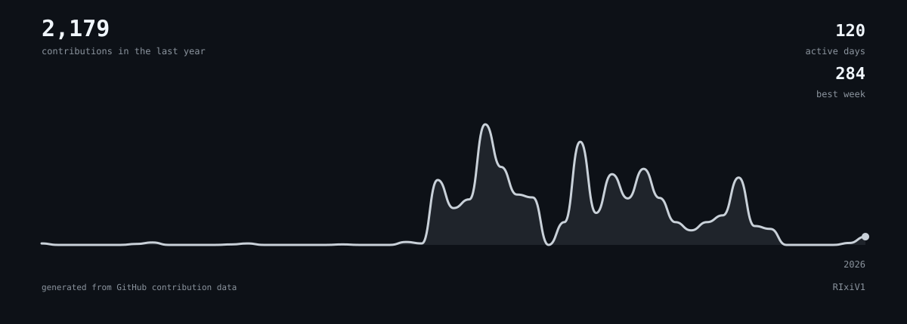

 

 

<a href="https://github.com/RIxiV1">GitHub</a>
&nbsp;&nbsp;·&nbsp;&nbsp;
<a href="https://www.linkedin.com/in/shaiksuhaib">LinkedIn</a>
&nbsp;&nbsp;·&nbsp;&nbsp;
<a href="mailto:shaiksuhaib360@gmail.com">Email</a>

 

<h2>about</h2>

<b>Suhaib</b> — BTech IT student and software engineer.

I like building things, breaking things, and occasionally making them work.

Currently interested in:

<ul>
<li>Full-stack development</li>
<li>AI / ML</li>
<li>Developer tools</li>
<li>Product engineering</li>
</ul>

When I'm not coding, I'm probably gaming.

<h2>projects</h2>

<h3>
<a href="https://github.com/RIxiV1/shadowscan">shadowscan</a>
</h3>

<b>AI Governance & Shadow AI Detection Platform</b>

Detects unsanctioned AI usage from existing browser, proxy, CASB, and access logs, then turns it into risk scores, audit findings, and governance reports.

<code>React</code>
<code>TypeScript</code>
<code>Node.js</code>
<code>MongoDB</code>
<code>JWT</code>

<h3>
<a href="https://github.com/RIxiV1/DIGITAL-CLINIC">DIGITAL-CLINIC</a>
</h3>

<b>Private, browser-based lab report interpreter</b>

Reads blood reports from PDFs or photos, handles difficult lab documents with multiple parsing strategies and OCR, and turns results into plain-language explanations and trends.

<code>React</code>
<code>TypeScript</code>
<code>Vite</code>
<code>OCR</code>
<code>PDF Parsing</code>

<h3>
<a href="https://github.com/RIxiV1/Caliber">Caliber</a>
</h3>

<b>AI Resume Screening & HR Review Platform</b>

Screens resumes against job descriptions, produces structured scores and reasoning, and gives HR admins a realtime dashboard for reviewing candidates and sending interview or rejection emails.

<code>React</code>
<code>TypeScript</code>
<code>Supabase</code>
<code>PostgreSQL</code>
<code>LLM</code>

<h3>
<a href="https://github.com/RIxiV1/InfoBlend">InfoBlend</a>
</h3>

<b>Browser extension for understanding the web</b>

A Manifest V3 extension that adds definitions, translations, summaries, pronunciation, and a local knowledge vault directly to the pages you browse.

<code>JavaScript</code>
<code>Manifest V3</code>
<code>Chrome</code>
<code>Firefox</code>

<h3>
<a href="https://github.com/RIxiV1/portfolio">portfolio</a>
</h3>

<b>Personal portfolio</b>

A Next.js portfolio built around real project case studies, product screenshots, animations, accessibility, and a hardened contact system.

<code>Next.js</code>
<code>React</code>
<code>TypeScript</code>
<code>Tailwind CSS</code>

<h3>
<a href="https://github.com/RIxiV1/KnowledgeForge">KnowledgeForge</a>
</h3>

<b>Local-first RAG over your own documents</b>

A local RAG application that ingests documents, combines semantic and keyword retrieval, reranks results, and answers questions with citations using a locally running LLM.

<code>Python</code>
<code>Ollama</code>
<code>ChromaDB</code>
<code>LangChain</code>
<code>Streamlit</code>

<h3>
<a href="https://github.com/RIxiV1/SubSentry">SubSentry</a>
</h3>

<b>Subscription tracking without the financial anxiety</b>

A privacy-conscious subscription tracker focused on making recurring expenses easier to understand and manage, without connecting directly to your bank.

<code>React</code>
<code>TypeScript</code>
<code>Supabase</code>
<code>Tailwind CSS</code>

<h2>stack</h2>

<code>TypeScript</code>
<code>Python</code>
<code>JavaScript</code>
<code>React</code>
<code>Next.js</code>
<code>Node.js</code>
<code>SQL</code>

